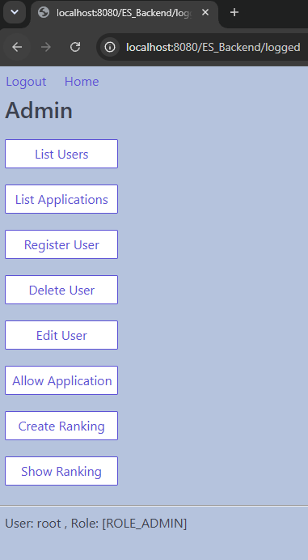
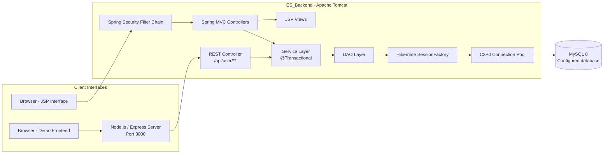
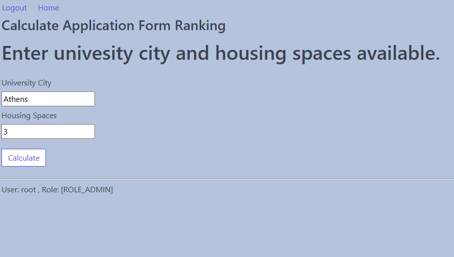
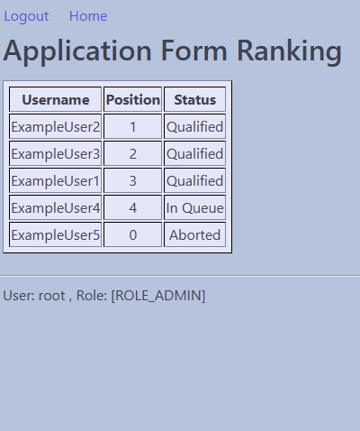
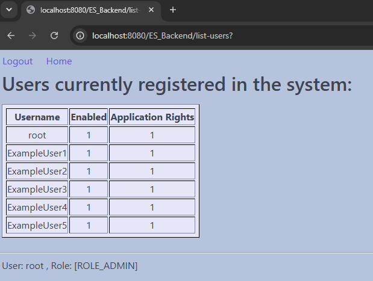
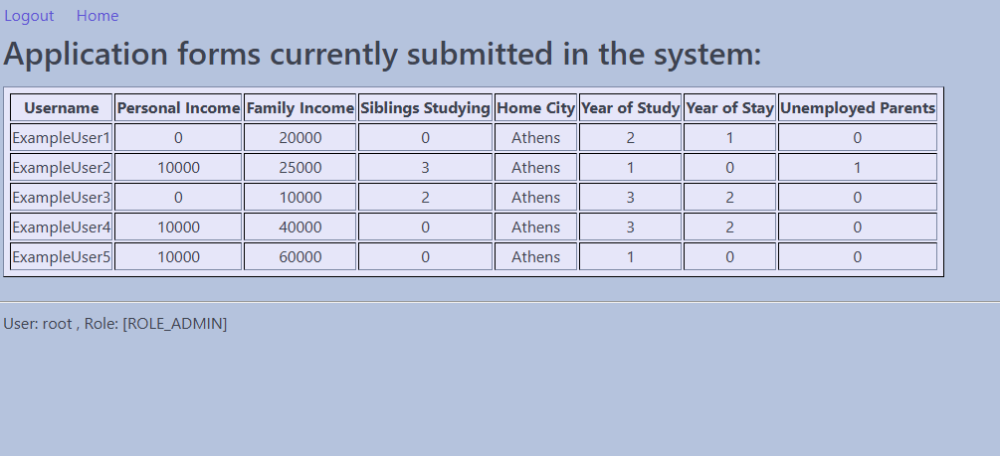
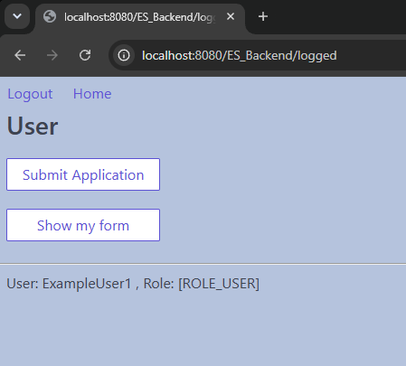
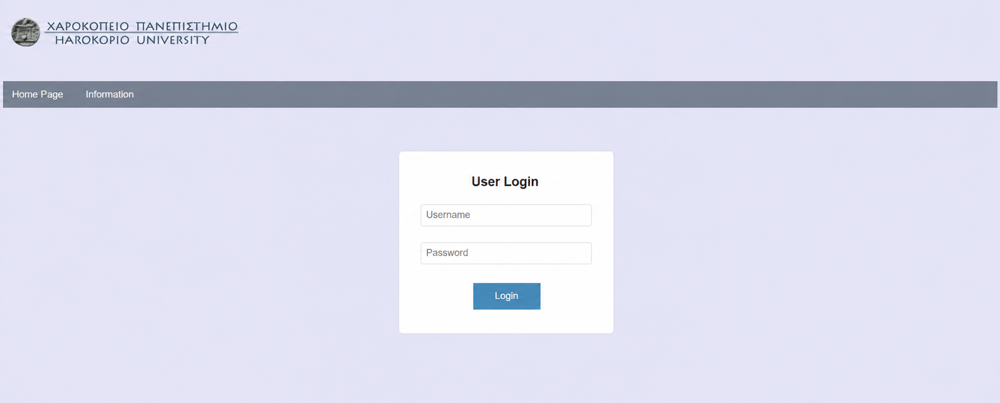
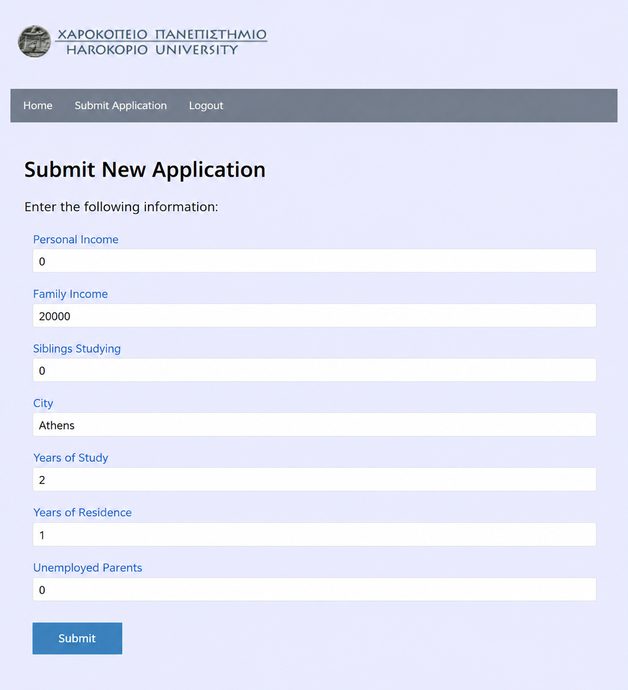
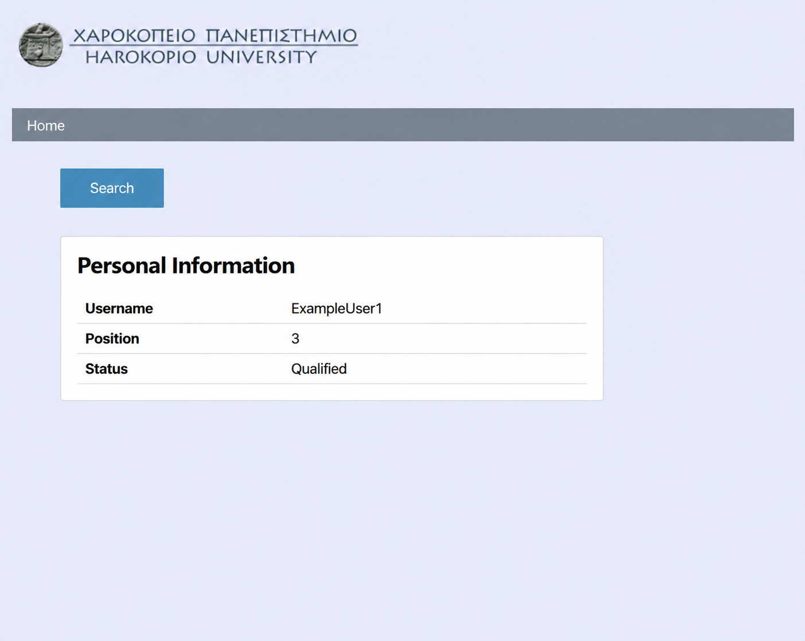

# Student Housing Application Management System

A student-housing application and ranking system centered on a **Java Spring MVC backend** with **Hibernate-based persistence**, **Spring Security authentication**, and a **MySQL** database. A separate lightweight **Node.js / Express frontend** is included as a demonstration client for the backend REST interface.

> **Project emphasis:** `ES_Backend` is the core of the system. `ES_Frontend` is a separate client used to demonstrate and exercise the backend API from outside the Spring MVC/JSP interface.

## Academic Context

This project was developed collaboratively as a **university project focused on Distributed Systems**. Its primary technical emphasis is the backend: request handling, layered application design, authentication, persistence, transactional data access, user/application lifecycle management, and the calculation of a housing-allocation ranking from configurable eligibility criteria.

## Overview

The application manages the lifecycle of student housing requests. Administrators can create and maintain user accounts, grant application rights, inspect submitted applications, and calculate the final housing ranking. Registered users can submit or replace their application and inspect their own application and ranking status.

The backend supports two presentation paths:

1. A **server-rendered Spring MVC/JSP interface**, protected by Spring Security.
2. A **REST-style API under `/api/user/**`**, consumed by the separate Express frontend.

Both paths use the same service and persistence layers. This keeps the business logic and database access inside the Java backend while allowing the backend to be demonstrated through more than one client.




## System Architecture

The application follows a layered backend design. Web requests are handled by Spring MVC controllers or the REST controller, passed through service classes with transactional boundaries, and persisted through DAO implementations backed by Hibernate sessions.



The backend therefore remains independent of the demonstration client. The Express application does not implement the domain model or ranking logic; it forwards user actions to the backend API and renders the returned data.


## Technology Stack

### Backend

| Technology | Role |
| --- | --- |
| **Spring Framework 5.2.2** | Dependency injection, MVC and transaction integration |
| **Spring MVC** | HTTP request routing and JSP-based web interface |
| **Spring Security 5.2.1** | JDBC authentication, BCrypt password verification and authenticated MVC access |
| **Apache Tomcat 8.5** | Servlet container / backend runtime |
| **MySQL 8** | Relational database |
| **Hibernate 5.4.10** | ORM and persistence layer |


### Frontend

| Technology | Role |
| --- | --- |
| **Node.js** | Frontend server runtime |
| **Express 4.17** | Static page hosting and request routing |

## Setup and Running

### Prerequisites

- **Java 8 / JDK 8**
- **Apache Maven**
- **Apache Tomcat 8.5**
- **MySQL 8**
- **Node.js** and **npm**

### Database Configuration

Database connection values are intentionally not committed to the repository.

Copy:

```text
ES_Backend/src/application.properties.example
```

to:

```text
ES_Backend/src/application.properties
```

and provide your own local connection settings:

```properties
jdbc.url=jdbc:mysql://localhost:<port>/<database>?useSSL=false&allowPublicKeyRetrieval=true
jdbc.user=<username>
jdbc.password=<password>
```

The real `application.properties` file is ignored by Git so local database credentials are not accidentally committed. After a successful database connection, Hibernate's `hbm2ddl.auto=update` setting creates or updates the required tables.

After the schema has been created, an administrator account must be available to access the administrative functionality of the MVC application. The repository includes `database/seed-admin.sql`, which contains the administrator seed records retained from the original project and can be executed to bootstrap the initial administrator account.

Default development credentials:

- **Username:** `root`
- **Password:** `root`

These credentials are intended only for local demonstration and development.

### Backend

`ES_Backend` is a traditional Maven WAR project using the original Eclipse-style `src` and `WebContent` layout. Import it as a Maven web application and deploy it to **Tomcat 8.5**.

The demonstration frontend expects the backend to be available under the following context path:

```text
/ES_Backend
```

If a different deployment workflow is used, ensure the locally configured `application.properties` is available on the backend runtime classpath as `application.properties`.

### Frontend

After the backend is running:

```bash
cd ES_Frontend
npm ci
node index.js
```

The Express client listens on:

```text
http://localhost:3000
```

and communicates with:

```text
http://localhost:8080/ES_Backend/api/user
```

## Backend Architecture

The application is a traditional Spring MVC application rather than a Spring Boot project and is packaged as a **WAR** for deployment to an external servlet container.

The implementation is divided into the following major layers:

```text
HTTP request
    │
    ▼
Controller / REST Controller
    │
    ▼
Service Interface + Implementation
    │   @Transactional
    ▼
DAO Interface + Implementation
    │
    ▼
Hibernate SessionFactory
    │
    ▼
C3P0 DataSource
    │
    ▼
MySQL
```

This separation keeps request handling, business operations and persistence concerns distinct.

## Controller Layer

The MVC controller layer is divided by responsibility.

| Controller | Responsibility |
| --- | --- |
| `LoginController` | Login view and post-authentication routing |
| `UserController` | User registration, deletion, editing, application permissions and user listing |
| `ApplicationFormController` | Application submission, replacement, listing and current-user application display |
| `ApplicationFormRatingController` | Ranking calculation and ranking display |
| `ApiController` | REST-style operations consumed by the Express frontend |

### `LoginController`

After a successful Spring Security login, the application redirects to `/logged`. The controller inspects the authenticated role and returns either the administrator or standard-user landing page.

### `UserController`

The user-management controller implements the main account administration operations:

- register a new user;
- generate a BCrypt password hash before storage;
- assign `ROLE_USER` to newly created users;
- delete existing users;
- edit usernames and passwords;
- grant application-submission permission;
- list currently registered users.

New users are created with application submission disabled:

```text
can_apply = -1
```

An administrator can subsequently grant submission permission, changing this value to:

```text
can_apply = 1
```

The controller also protects the administrator account from the supported delete/edit/permission operations by checking for `ROLE_ADMIN` before performing those actions.

### `ApplicationFormController`

This controller handles application operations through the authenticated MVC interface.

The currently authenticated username is obtained from Spring Security's `SecurityContextHolder`, so users do not manually provide a username when submitting an application through the JSP interface.

A user can submit an application only when `can_apply == 1`.

The application fields include:

- personal income;
- family income;
- number of siblings currently studying;
- home city;
- current year of study;
- number of previous years in student housing;
- number of unemployed parents.

When a user submits another application, the previous application is deleted before the new one is saved. The system therefore maintains **one current application per username** at application level.

### `ApplicationFormRatingController`

The ranking controller is responsible for the core allocation algorithm.
The full ranking behavior is described in [Housing Ranking Algorithm](#housing-ranking-algorithm).

## Service Layer

Each persistent domain type has a service interface and implementation:

```text
ApplicationFormService
ApplicationFormRatingService
AuthorityService
UserService
```

with corresponding `*ServiceImpl` classes.

The service implementations are annotated with `@Service`, injected with their corresponding DAO, and define transaction boundaries using `@Transactional`.

For example, the application path is:

```text
ApplicationFormController
        │
        ▼
ApplicationFormService
        │
        ▼
ApplicationFormServiceImpl @Transactional
        │
        ▼
ApplicationFormDAO
        │
        ▼
ApplicationFormDAOImpl
```

Placing transaction management at this layer separates persistence transaction concerns from the HTTP controllers and lets DAO implementations work with Hibernate's current session.

## DAO Layer

Persistence is implemented through explicit DAO interfaces and Hibernate-backed implementations.

The four DAO pairs are:

```text
UserDAO                  / UserDAOImpl
AuthorityDAO             / AuthorityDAOImpl
ApplicationFormDAO       / ApplicationFormDAOImpl
ApplicationFormRatingDAO / ApplicationFormRatingDAOImpl
```

DAO implementations are annotated with `@Repository` and receive the configured `SessionFactory` through Spring dependency injection.

The implementation uses Hibernate directly:

- `sessionFactory.getCurrentSession()` for transaction-bound sessions;
- `Session.get(...)` for primary-key lookup;
- `Session.save(...)` for persistence;
- `Session.delete(...)` for removal.
- HQL queries for collection retrieval;

This is intentionally more explicit than a Spring Data repository approach and exposes the persistence workflow directly, which was appropriate to the project's educational focus.

## Hibernate and Persistence

Hibernate is configured through `LocalSessionFactoryBean` in the Spring XML application context.

Entity discovery is restricted to:

```text
es.hua.exercise.backend.entity
```

The current runtime configuration uses:

```xml
<prop key="hibernate.dialect">org.hibernate.dialect.MySQL8Dialect</prop>
<prop key="hibernate.show_sql">true</prop>
<prop key="hibernate.hbm2ddl.auto">update</prop>
```

`hibernate.hbm2ddl.auto=update` allows Hibernate to create or update the required tables during development startup.

### Connection Pool

The application uses the following pool configuration:

| Property | Value |
| --- | ---: |
| Initial pool size | `5` |
| Minimum pool size | `5` |
| Maximum pool size | `20` |
| Maximum idle time | `30000` |

The MySQL driver used is:

```text
com.mysql.cj.jdbc.Driver
```

Database connection values are supplied locally through `application.properties` rather than embedded directly in the Spring XML configuration. No populated `application.properties` file is committed to this repository; a blank template is provided under `ES_Backend/src/application.properties.example`.

## Database Model

The backend defines four JPA entities and four corresponding database tables.

### `user`

Represents an application account.

| Field | Purpose |
| --- | --- |
| `id` | Auto-generated primary key |
| `username` | Login name |
| `password` | BCrypt password hash |
| `enabled` | Spring Security account-enabled flag |
| `can_apply` | Application permission flag (`-1` denied, `1` allowed) |

### `authorities`

Stores the role assigned to a username.

| Field | Purpose |
| --- | --- |
| `id` | Auto-generated identifier |
| `username` | Account username |
| `authority` | Spring Security authority such as `ROLE_USER` or `ROLE_ADMIN` |

### `application`

Stores the user's current housing application.

| Field | Purpose |
| --- | --- |
| `id` | Auto-generated primary key |
| `username` | Applicant username |
| `personal_income` | Applicant personal income |
| `family_income` | Family income |
| `siblings_studying` | Number of studying siblings |
| `home_city` | Applicant home city |
| `year_studying` | Current university study year |
| `year_staying` | Previous years in student housing |
| `unemployed_parents` | Number of unemployed parents |
| `points` | Ranking points used during evaluation |
| `status` | Application evaluation status |

### `application_rating`

Stores the result of the most recently calculated ranking.

| Field | Purpose |
| --- | --- |
| `id` | Auto-generated primary key |
| `username` | Applicant username |
| `position` | Ranking position; aborted applications use `0` |
| `status` | Final allocation result |

### Relationship Model

The project deliberately uses a simple persistence model. The entities do not define JPA `@OneToOne`, `@OneToMany` or `@ManyToOne` associations. Instead, relationships are coordinated by application logic using usernames and identifiers.

This keeps the domain objects independent, but also means lifecycle operations such as deleting a user's application are implemented explicitly by the controller/service logic rather than through ORM cascade annotations.

## Spring Security

The MVC application uses Spring Security with a custom Java configuration class:

```text
es.hua.exercise.backend.security.AppSecurityConfig
```

The security filter chain is registered by:

```text
SecurityWebApplicationInitializer
```

### JDBC Authentication

Authentication is performed directly against the MySQL database using Spring Security's JDBC authentication support.

User lookup:

```sql
select username, password, enabled
from user
where username = ?
```

Authority lookup:

```sql
select username, authority
from authorities
where username = ?
```

Passwords are encoded and verified using:

```text
BCryptPasswordEncoder
```

New users created by the backend are therefore stored with BCrypt hashes rather than plaintext passwords.
After login, `LoginController` selects the administrator or normal-user landing view according to the authenticated role.

### REST API Security Boundary

The Spring Security configuration explicitly excludes `/api/**` from the MVC security filter chain. As a result, the server-rendered MVC/JSP routes use Spring Security authentication, while the demonstration REST endpoints are accessed separately by the Express client. The frontend performs its login check through `/api/user/getUser` before exposing its user-facing flow.

## REST API

`ApiController` exposes the backend operations required by the external frontend under:

```text
/ES_Backend/api/user
```

| Method | Endpoint | Purpose |
| --- | --- | --- |
| `POST` | `/getUser` | Verify username/password for the demonstration frontend |
| `GET` | `/checkCanApply/{username}` | Check whether the user is currently allowed to submit an application |
| `POST` | `/submitForm` | Submit or replace the user's application |
| `GET` | `/getForm/{username}` | Retrieve the user's current application |
| `GET` | `/getFormRating/{username}` | Retrieve the user's most recently calculated ranking entry |

### Example: ranking lookup

```http
GET /ES_Backend/api/user/getFormRating/exampleUser
```

The returned ranking object contains:

```json
{
  "id": 1,
  "username": "exampleUser",
  "position": 2,
  "status": "Qualified"
}
```

The entity classes currently provide their API representation through explicit `jsonFormat()` methods. The API therefore remains intentionally small and tightly matched to the frontend requirements.

## User Registration

An administrator creates a new account with:

```text
ROLE_USER
enabled = 1
can_apply = -1
```

The password is BCrypt-encoded before the user is persisted.

A newly registered user can authenticate but cannot yet submit a housing application.

## Application Permission

The administrator explicitly grants submission rights by changing:

```text
can_apply: -1 -> 1
```

The authenticated MVC submission flow checks this flag directly. The Express demonstration client checks it through `/api/user/checkCanApply/{username}` before sending an application to `/api/user/submitForm`.

## Application Replacement

A user maintains a single current application.

When the same user submits again:

```text
Existing application found
        │
        ▼
Delete previous application
        │
        ▼
Save new application
```

This gives the latest submitted application precedence without retaining multiple active submissions for the same user.

## User Deletion

Deleting a user also removes their current application if one exists.

The controller performs this explicitly:

```text
Delete User
   │
   ├── Find current Application
   │      └── Delete Application if present
   │
   ├── Delete Authority
   │
   └── Delete User
```

The ranking behaves differently by design. A previously calculated ranking is a persisted snapshot, so deleting a user does **not** immediately remove their existing `application_rating` entry. That entry remains visible until the ranking is recalculated. The next calculation clears the previous ranking and rebuilds it from the set of applications that currently exists.

This distinction is intentional:

- `application` represents current application state;
- `application_rating` represents the last completed ranking calculation.

## Housing Ranking Algorithm

The ranking subsystem is the main business-logic component of the application.

The administrator supplies two values when calculating a ranking:

```text
University city
Available housing spaces
```

The university city is used when evaluating whether the applicant lives outside the university's location, while the housing-space value determines how many applicants can receive a final `Qualified` result.



### Automatic Priority Qualification

An applicant receives priority qualification when both conditions are true:

```text
personal_income == 0
unemployed_parents == 2
```

The application is qualified and does not require point-based ordering.
The applicant is considered before the normal scored queue. If all housing spaces have already been allocated, the final ranking entry becomes `In Queue` despite the priority condition.

### Automatic Rejection

An application is marked:

```text
Aborted
```

when either condition is true:

```text
year_studying > 4
```

or:

```text
year_staying >= 4
```

Aborted applications receive zero points and are stored at the end of the generated ranking with ranking position `0`.

### Scored Queue

Applications that are neither automatically qualified nor aborted enter the normal point-based queue.
Their intermediate application status is queued. After the queue has been sorted and housing capacity has been applied, their persisted ranking result becomes either qualified or in queue.

## Point Calculation

The point system implemented by the backend is:

| Criterion | Points |
| --- | ---: |
| Family income below `10,000` | `+100` |
| Family income from `10,000` to below `15,000` | `+30` |
| Home city differs from university city | `+50` |
| Each sibling currently studying | `+20 / sibling`  |
| Previous student-housing stay | `-10 / year`  |

The final point value cannot become negative:

```text
points = max(points, 0)
```

The city comparison in the current implementation is a direct string comparison between the submitted home city and the university city supplied by the administrator.

### Example

For an otherwise eligible applicant with:

```text
Family income:           9,000
Studying siblings:       1
Home city:               different from university
Previous housing years:  1
```

The score is:

```text
100 + 20 + 50 - 10 = 160 points
```

Example of a total ranking in the system, visible to the administrator:



## Backend MVC Interface

Although the backend is primarily important for its application and persistence logic, it also contains a complete JSP interface that can be used without the separate Node.js frontend.

### Administrator Interface

After authentication as an administrator, the backend presents operations for:

- listing registered users;
- listing current applications;
- registering users;
- deleting users;
- editing user credentials;
- granting application rights;
- calculating a ranking;
- viewing the full ranking.

The administrator dashboard provides direct access to the backend management operations shown earlier. The two principal inspection views expose the current account state and the application data that will be consumed by the ranking process.





### Standard User Interface

A standard authenticated user can:

- submit an application when permission has been granted;
- replace a previously submitted application;
- view their current application.




The backend JSP layer uses shared header/footer fragments and Spring Security tags to display the current authenticated username and authorities.

## Frontend Client

The provided front-end is a separate Node.js/Express application included to demonstrate the backend from an external client.


Its purpose is not to duplicate the backend architecture. It provides a simpler user-facing path into a subset of backend operations and confirms that the Java application can expose its functionality outside the JSP interface.

> **Note:** The external frontend is implemented in Greek, as it was originally developed for the university coursework. The screenshots below use browser translation to English for documentation purposes.




## Frontend Request Flow

The Express server listens on port `3000` and communicates with the backend at:

```text
http://localhost:8080/ES_Backend/api/user
```

## Frontend Routes

### Page Routes

| Method | Route | Page |
| --- | --- | --- |
| `GET` | `/` | Welcome page |
| `GET` | `/login` | Login page |
| `GET` | `/home` | User home page |
| `GET` | `/about` | Project/application information |
| `GET` | `/submitForm` | Housing application form |
| `GET` | `/showForm` | Current application display |
| `GET` | `/showRating` | Personal ranking display |

### Backend-Proxy Routes

| Method | Frontend Route | Backend Operation |
| --- | --- | --- |
| `POST` | `/login` | Verify credentials through `/api/user/getUser` |
| `POST` | `/submitForm` | Check permission and submit application |
| `POST` | `/showForm` | Retrieve current application |
| `POST` | `/showRating` | Retrieve current ranking entry |

### Demonstration

The external client exposes the main user-facing operations required to exercise the backend API. Application submission collects the same domain data persisted by `ApplicationFormService`, while the ranking view renders the corresponding `application_rating` result returned by the backend.





## Project Structure

```text
spring-housing-application-system/
├── ES_Backend/              
│   ├── src/
│   ├── WebContent/
│   └── pom.xml
│
├── ES_Frontend/             
│   ├── public/
│   ├── index.js
│   ├── package.json
│   └── package-lock.json
│
├── assets/
│   └── screenshots/
│
├── database/
│   └── seed-admin.sql
│
├── .gitignore
└── README.md
```

## Project Team

Developed collaboratively as part of a university coursework project by:

- [Giannis Dinos](https://github.com/johndinos99)
- [Marios Bairami](https://github.com/mariosbairami)
- [Fotis Karagiannis](https://github.com/fotis-karagiannis)

